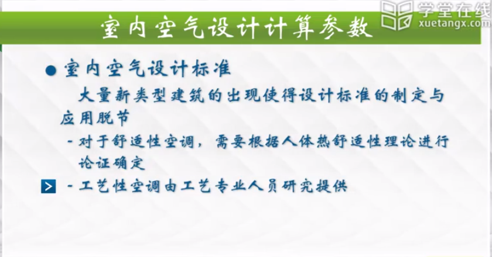
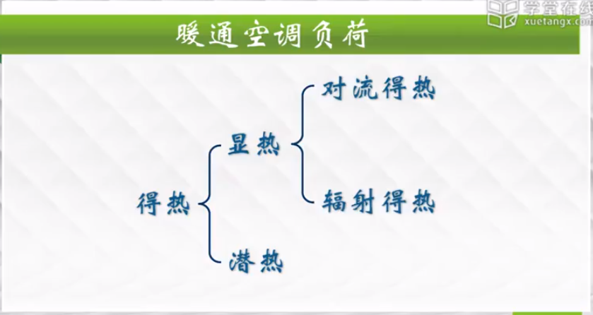

### 怎么确定供暖、空调、通风负荷

#### 室外空气设计计算参数

* 夏季
通风
* 温度：历年最热月14时月平均温度的平均值
* 湿度：历年最热月14时月平均相对湿度的平均值
空调
* 干球温度twg：历年平均不保证50小时的干球温度
* 湿球温度：历年平均不保证50小时的湿球温度
* 日平均温度twp：平均不保证5天的日平均温度

#### 空调夏季设计日的气象参数
* 夏逐时干球温度展开方法1：余弦函数法

***注：日较差法更接近于我们平常的温度变化情况***

